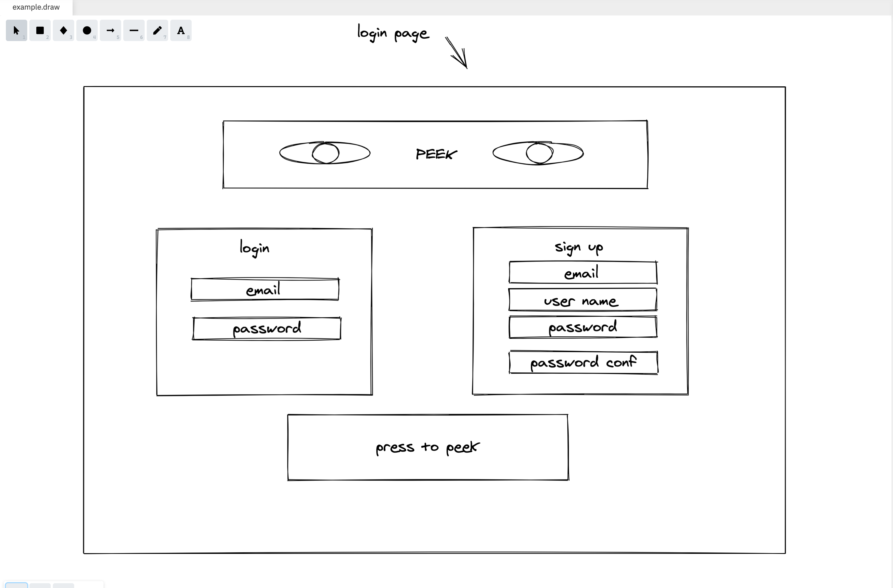
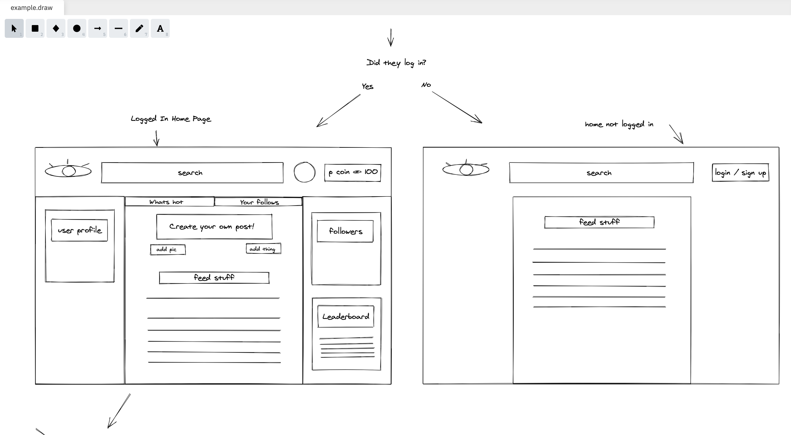
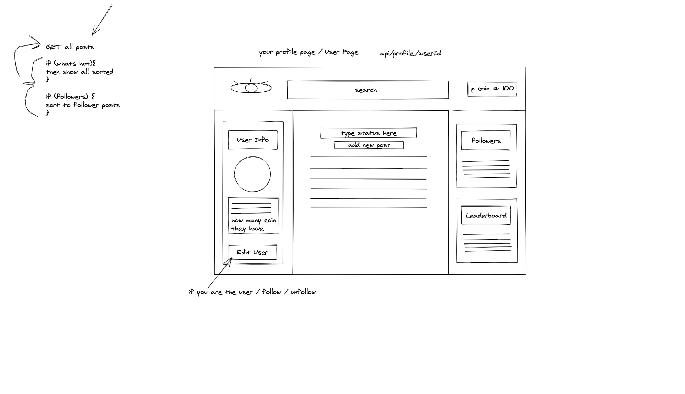
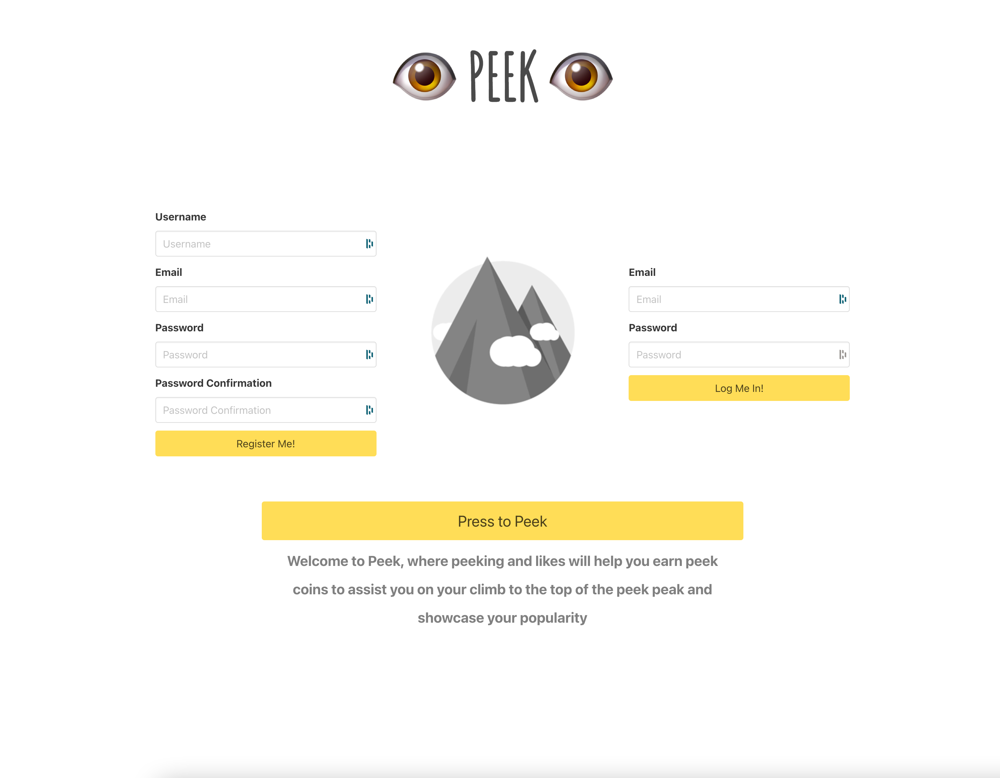
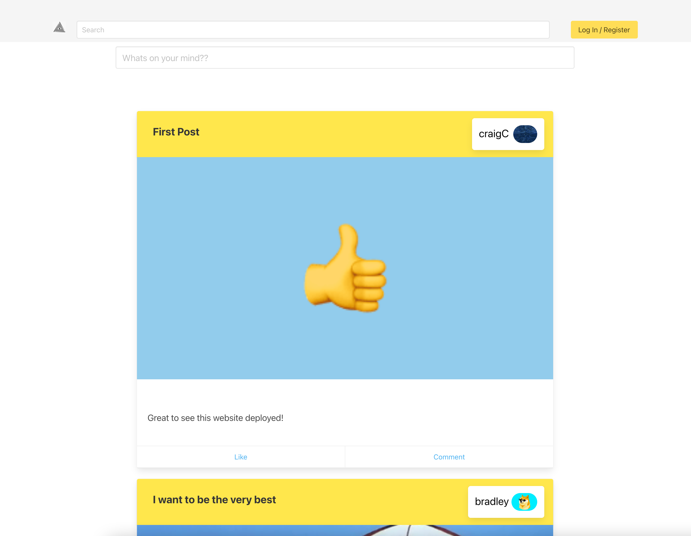
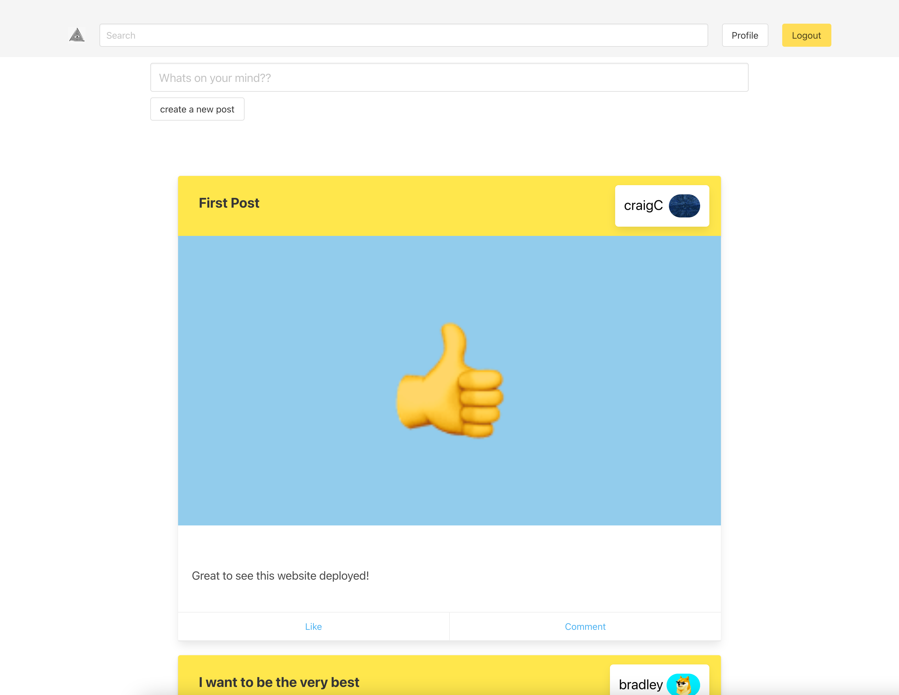
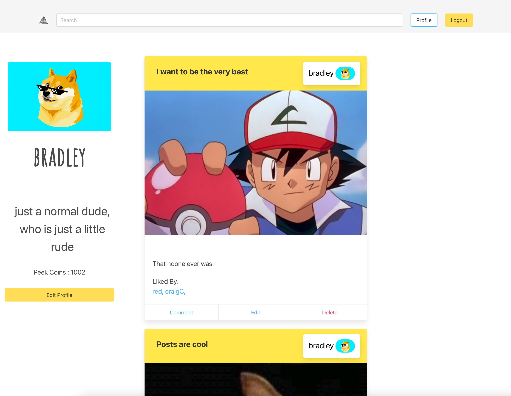

#  Project 3 - PEEK

  

## Brief 

All groups were given a week to create a fullstack MERN App using a custom build Backend API.

## Technologies
-   **Back-End**:
    
    -   Express
    -   MongoDB
    -   Node.js
    - Backend API  [here](https://peekback.herokuapp.com/api)

-   **Front-End**:
    
    -   CSS3 + SASS
    -   HTML5
    -   JavaScript (ES6)
    -   React.js
    -  Google Fonts
    -  Bulma
-   **Dependencies**:
    
    -   Axios
    -   bcrypt
    -   JSONWebToken
    -   mongoose-unique-validator
    -   npm
    -   react-router-dom

-   **Development Tools**:
    -   Git + GitHub
    -   Heroku
    -   VS Code

## Deployment 
- click [here](https://peek3.netlify.app) to see the deployed App.
- click [here](https://github.com/bradb345/project-3-server) to see the Server Github repository
- click [here](https://github.com/bradb345/project-3-client) to see the Client Github repository

## Members

Craig Clement - [Github](https://github.com/CraigClem)
Dan Fullerton - [Github](https://github.com/sirdantheawesome)
Bradley Bernard - [Github](https://github.com/bradb345)

## Approach

- After a short brainstorming session we decided to create a Social Media App called "PEEK" that was similar to Facebook and Instagram but rewarded the user with points for post interaction.

### Layout

- We put together a rough sketch of what the site will look like with a rough idea of how it will function.

Login

Main feed

Profile feed


### - Backend

####  Models
- We had Two models, Posts and Users. The User model 6 keys, email, username, password, image, summary and peekcoin. once the user typed their password it would be encrypted using bcrypt and also salted with bcrypt. the password and email were then hidden so that those keys would not show up in a request.

```js
const userSchema = new mongoose.Schema({
  email: { type: String, required: true, unique: true },
  username: { type: String, required: true, unique: true },
  password: { type: String, required: true },
  image: { type: String, required: false },
  summary: { type: String },
  peekcoin: { type: Number },
})


userSchema.pre('save', function encryptPassword(next) {
  if (this.isModified('password')) {
    this.password = bcrypt.hashSync(this.password, bcrypt.genSaltSync())
  }
  next()
})

userSchema.methods.validatePassword = function validatePassword(password) {
  return bcrypt.compareSync(password, this.password)
}

userSchema
  .virtual('passwordConfirmation')
  .set(function setPasswordConfirmation(passwordConfirmation) {
    this._passwordConfirmation = passwordConfirmation
  })

userSchema
  .pre('validate', function checkPassword(next) {
    if (this.isModified('password') && (this.password !== this._passwordConfirmation)) {
      this.invalidate('passwordConfirmation', 'should match password')
    }
    next()
  })


userSchema.plugin(mongooseUniqueValidator)
userSchema.plugin(mongooseHidden({ defaultHidden: { password: true, email: true, _id: false } }))
export default mongoose.model('User', userSchema)
``` 

- Posts also had 6 keys, title, text, image, userlikes, user and comments.

```js
const commentSchema = new mongoose.Schema({
  text: { type: String, required: true },
  user: { type: mongoose.Schema.ObjectId, ref: 'User', required: true },
}, {
  timestamps: true,
})

const postSchema = new mongoose.Schema({
  title: { type: String, required: true },
  text: { type: String, required: true },
  image: { type: String },
  userlikes: { type: [String], required: false },
  user: { type: mongoose.Schema.ObjectId, ref: 'User', required: true },
  comments: [commentSchema],
})

export default mongoose.model('Post', postSchema)
```
#### Routes

Here are the endpoints for the App.

```js
router.route('/posts')
  .get(postController.index)
  .post(secureRoute, postController.createPost)

router.route('/posts/:postId')
  .get(postController.show)
  .put(secureRoute, postController.updatePost)
  .post(secureRoute, postController.likePost)
  .delete(secureRoute, postController.removePost)

// * Comments

router.route('/posts/:postId/comments')
  .post(secureRoute, commentController.createComment)

router.route('/posts/:postId/comments/:commentId')
  .put(secureRoute, commentController.updateComment)
  .post(secureRoute, commentController.likeComment)
  .delete(secureRoute, commentController.removeComment)

// * User Profiles

router.route('/profile')
  .get(userController.indexProfiles)

router.route('/profile/:profileId')
  .put(secureRoute, userController.updateProfile)
  .get(userController.showProfile)

// * Auth

router.route('/login')
  .post(userController.login)

router.route('/register')
  .post(userController.register)
 ```

### - Frontend

#### Feeds

- -   For the posts, I made a try catch async function that makes a GET request to the backend server to get all the posts. after awaiting the request, If the request was successful I set the response data to state, if the request failed I set the isError state to true. If there was no error but the posts state is still null, then that means that isLoading is true. if any of these states and constants are true then a message is conditionally rendered to the page.

```js
const [posts, setPosts] = React.useState(null)
const [isError, setIsError] = React.useState(false)
const isLoading = !posts && !isError
  ```

-In the useEffect function I set the popup and input props so that when those values change it will trigger a re-render to the page.

```js
React.useEffect(() => {
    const getData = async () => {
      try {
        const res = await getAllPosts()
        setPosts(res.data.reverse())
      } catch (err) {
        setIsError(true)
      }
    }
    getData()
  }, [popup, input])
```

- I then filtered the response of the GET request and passed the key values into the PostCard component where each result was mapped. If userId was true then the user was one a specific profile and would only see posts that belonged to that userId. If userId was false then that meant that the user was on the main feed and wanted to see all the posts. 

```js
const filterPosts = (userId) => {
    return (
      posts.filter((post) => {
        if (userId) {
          return (
            (post.title.toLowerCase().includes(input) ||
              post.text.toLowerCase().includes(input) ||
              post.user.username.toLowerCase().includes(input))
            && (post.user._id.includes(userId))
          )
        }
        return (
          (post.title.toLowerCase().includes(input) ||
            post.text.toLowerCase().includes(input) ||
            post.user.username.toLowerCase().includes(input))
        )
      })
    )
  }

  return (
    <section className='section'>
      <div className='container'>
        <div className='columns is-multiline'>
          {isError && <Error />}
          {isLoading && <p className="subtitle has-text-centered is-fullwidth">...Loading</p>}
          {posts &&
            filterPosts(userId).map((post) => (
              <PostCard
                key={post._id}
                title={post.title}
                image={post.image}
                text={post.text}
                userId={post.user._id}
                comments={post.comments}
                likedByArray={post.userlikes}
                postId={post._id}
                handleUpdatePosts={handleUpdatePosts}
              />
            ))
          }
        </div>
      </div>
    </section>
  )
``` 

#### Status updates and creating posts

- I took on the task of building the status update and creating a new post functionality. I created a form that would pop up if the popup state modal was set to is-active. To set the modal to active I created a handleClick function that checks to see if the form has been filled out initially, if not, it  would bring up the form window for creating a new post. the handleClick also checks to see if the title equals "whats on my mind" and the text length is greater than 1. If these conditions are met, then clicking would create a status update. 

```js
const history = useHistory()
  const [popup, setPopup] = React.useState('modal')

  const { formdata, handleChange } = useForm({
    title: 'whats on my mind',
    text: '',
  })

  const handleClose = () => {
    setPopup('modal')
  }

  const handleSubmit = async () => {

    if (!isAuthenticated()) {
      history.push('/')
    }

    try {
      await createPost(formdata)

      history.push('/feed')
    } catch (err) {
      console.log(err)
    }
  }

  const handleClick = () => {
    if (formdata.title === 'whats on my mind' && formdata.text.length > 1) {
      handleSubmit()
      history.push('/feed')
      location.reload()
    } else {
      setPopup('modal is-active')
    }
  }
```

## Screenshots

Login page



Unregistered feed


Registered feed


Profile feed
